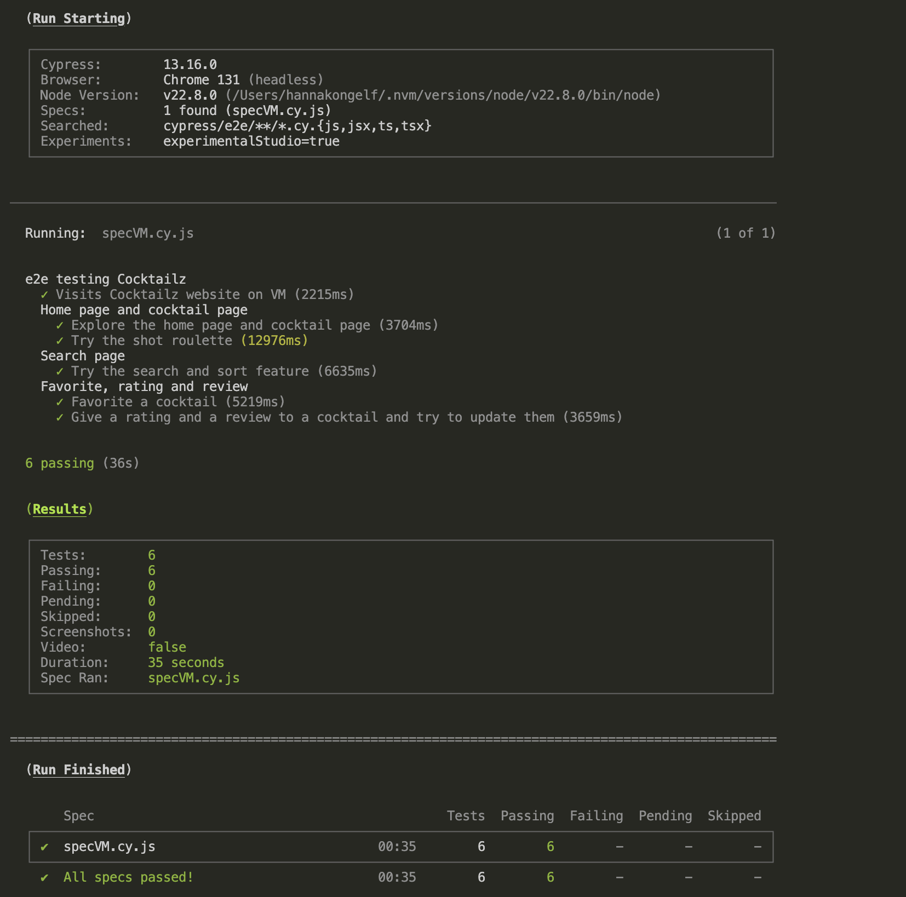
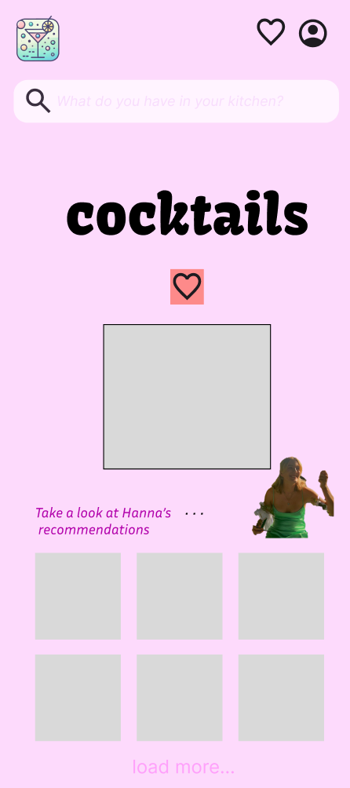
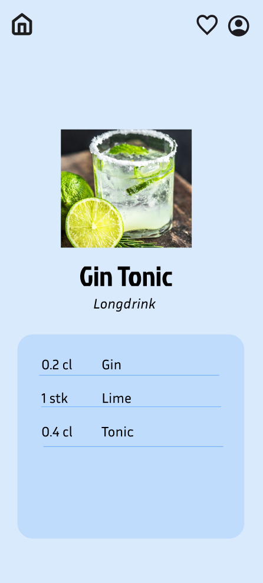
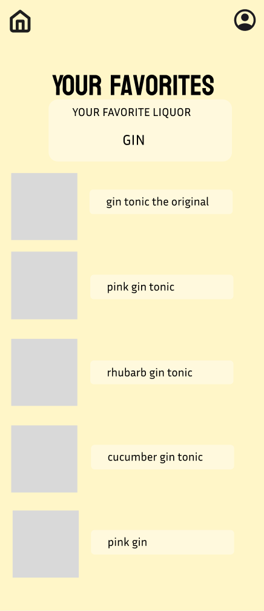
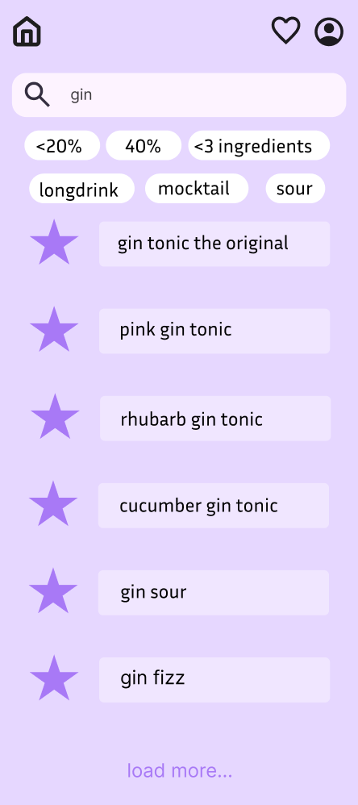
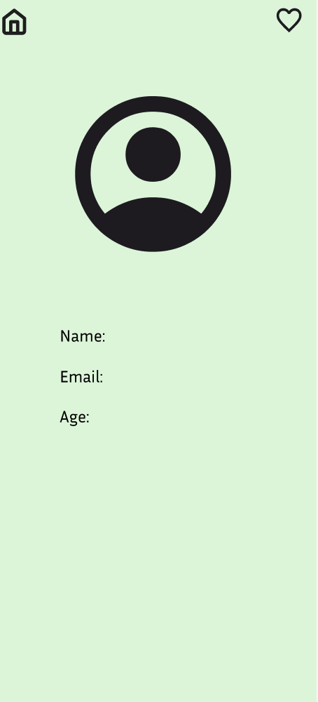

# Cocktailz

## About Cocktailz

**_Cocktailz_** is an application designed for exploring a wide variety of drinks. Users can search for specific cocktails and view their ingredients. Additionally, drinks can be filtered based on general categories such as the type of spirit or through more specific options, like limiting the maximum number of ingredients. It is also possible to sort cocktails various criteria. Registered users have the ability to favorite and rate drinks and leave reviews.

> Cocktailz aims to provide a fun and interactive way to discover new cocktails and expand your drink repertoire.

## Accessing the Project on Virtual Machine
**Network Requirement**: Ensure you are connected to the NTNU network. If you are off-campus, connect using NTNU's VPN

**Link to VM**:

> [http://it2810-02.idi.ntnu.no/project2](http://it2810-02.idi.ntnu.no/project2)

## Table of Contents

- [Development Progress](#development-progress)
- [Key Features](#key-features)
- [Our Sustainable Choices for the App](#our-sustainable-choices-for-the-app)
- [Our Accessibility Choices for Improving the App](#our-accessibility-choices-for-improving-the-app)
- [Tech Stack](#tech-stack)
- [Key Decisions and Reasoning](#key-decisions-and-reasoning)
- [Setup instructions](#setup-instructions)
- [Scripts](#scripts)
- [Testing guide](#testing-guide)
- [Linting and prettier](#linting-and-prettier)
- [Development practices for group 2](#development-practices-for-group-2)
- [Assistance tools](#assistance-tools)
- [Design Images](#design-images)

## Development Progress
### Sprint 1
In sprint, the group focused on laying the fundation for the application. We prioritized completing the HomePage and CocktailPage, so it's easier to expand the app to pages like favorites and search page. To align the team from start, we created a Figme during the planning phase. The design mockups are included at the button of this README.md.

The group has also focused on getting main parts of the frontend up and running, and how to implement tailwind in the project. We created a mock_function in the backend to simulate data being retrieved, which contains six cocktails. These are used in HomePage and CocktailPage to simulate how it will look when the API is integrated into the application. There is also a static coded FavoritesPage to show the view of this page. The group adopted a mobile-first approach to simplify implementing responsive deisn. 

### Spint 2 
In Sprint 2, out focus shifted to creating seamless interaction between the client and backend, now hosted on a virtual mackine (VM). 

Key features implemented included searching, filtering, and pagination, making the app more interactive and user-friendly. We introduced Google Login, allowing users to easily log in, and added features for users to comment on and like cocktails.

A “Load More” feature was added to display 16 cocktails at a time, improving performance and enhancing the user experience. Staying true to the mobile-first approach, we ensured the design is fully responsive across devices. To improve navigation, we also added a “Go to Top” button, making it easier to browse through longer pages.

We set up the backend using **MongoDB** as our database. The database is filled with cocktail data from the [CocktailDB API](https://www.thecocktaildb.com/), providing a wide variety of cocktails for the app. This replaced the staitc mock data from Sprint 1. 

To enable seamless communication between the frontend and the database, we implemented an Apollo Client and configured a GraphQL server. This setup allows efficient data querying and ensures smooth interaction between the client and the backend.

### Sprint 3
Sprint 3, we improved the app based on feedback and added more features to enhence functinality. 

We improved filtering on SearchPage, allowing users to narrow results by cocktail name or ingredient. A dropdown for sorting options like alphabetical order was added. Bugs in the search bar were fixed, including issues where it reverted to old queries unexectedly. 

The FavoritesPages was fully developed, making it easy for users to save and access their favorite cocktails. We also added and improved features for liking, commenting, and rating cocktails. Users can view feedback from others and see the average rating, including their own.

To make the app more fun, we added a “Spin the Wheel” feature, which gives users a random shot suggestion.

Testing became a top priority. We used Cypress for end-to-end (e2e) testing to ensure all features worked properly and Vitest for testing individual components to improve reliability.

### Sprint 4
In Sprint 4, we focused on making the app better based on feedback. We improved the design, ensuring colors are more appropriate for each page and adjusting paddings and margins for a cleaner layout. We also removed the categories from the homepage, leaving only filtering and sorting options. This change improves app performance by reducing unnecessary loading.

A bug with comments, where they were not being saved to the backend, was identified and fixed. Additionally, we added tooltips in the navbar to enhance accessibility and implemented tab functionality, allowing users to navigate through elements using the keyboard.

To improve maintainability, we reorganized the file paths and folder structure, separating logic from components to make the codebase cleaner and more modular.

### Areas for Improvement in Future Sprints
In a later sprint, we would focus on avoiding the use of cache refetch and restore because it can lead to inconsistencies in data and unexpected behavior. Instead, we would aim to implement a more reliable state management. 

## Key Features

### Pages
- **HomePage**: On the HomePage, you can sort, filter, and search for cocktails. You can also view today's featured cocktail and like your favorites.
- **CocktailPage**: Clicking on a cocktail will take the user to a cocktail page where they can view the recipe, leave comments, rate the cocktail, and like it.
- **SearchPage**: On the SearchPage, you can search for, filter, and sort cocktails. You can also like a cocktail or click on it to view its recipe.
- **ProfilePage**: On the ProfilePage, you can log in to access personalized features.

### Core Functionality
- **Search**: Quickly find cocktails by name or ingredients.
- **Filter**: Quickly find cocktail types using filters. It is possible to filter by Shot, Soft Drink, Cocktail, Punch/Party Drink, or Homemade Liqueur.
- **Sorting**: You can sort filtered cocktails alphabetically (increasing or decreasing) and by the number of ingredients (increasing or decreasing). We decided to only allow sorting on filtered cocktails to improve sustainability. This approach reduces the size of the dataset being processed, leading to better performance.


### User Interaction
- **User Authentication**: Log in securly using Google Login to unlock personalized features. 
- **Favorites**: Save your favorites and access them on favoritepage
- **Comments**: Leave comments on cocktails through the FavoritesPage and CocktailPage. You can delete old comments and write new ones. On the CocktailPage, you can also view comments from other users. For privacy reasons, the identity of the commenter is not displayed.
- **Ratings**: Rate cocktails on the FavoritesPage and CocktailPage. You can delete a rating by clicking on your current rating. To give a new rating, simply hover and click on your desired rating.
- **Avrage rating**: On the CocktailPage, you can view the average rating of a cocktail, calculated based on your rating and ratings from other users.

### Additional Features
- **Spin the Wheel**: Get a random shot suggestion.
- **Pagination**: Display 8 to 16 cocktails at a time, with the option to click "Load More" to view additional cocktails.
- **Todays Cocktail**: On the HomePage, you are presented with a new cocktail suggestion every day.
- **Go to Top**: A "Go to Top" button has been implemented, allowing users to quickly navigate back to the top of the page.


## Our Sustainable Choices for the App
To make sustainable choices we have focused on:

- Filtering out unnecessary data as it helps improve efficiency. For example, instead of fetching all users, we only fetch the specific user required from the database. Similarly, we fetch ratings or reviews based on the user and cocktail, ensuring we only retrieve relevant information. This reduces the number of database calls, which in turn supports sustainability by minimizing resource usage.

- We focus on reducing code duplication, which means fewer instructions for the processor to execute, potentially leading to reduced energy consumption.

- We have chosen to use Apollo Client caching to fetch reviews and ratings, for example. This helps minimize unnecessary network requests by caching GraphQL query results, which improves sustainability by reducing server load and resource usage.

- We have choosen not to implement dark mode because of our design choices, most importantly the pastel colors, within the application. To stay sustainable with our design, implemetning dark mode would not align with our style and wanted impressions on the users.

- We have aimed to make the website as easy to navigate as possible, which helps users spend less time on it since they can quickly find what they need. Features like search, filtering, and sorting also help users complete their tasks more efficiently. Additionally, we have intentionally designed the website to avoid being addictive, unlike platforms like Snapchat, ensuring that it is only used when necessary. Shorter time spent on the website leads to reduced energy usage.

- Our application is designed to handle increasing data efficiently through GraphQL pagination and optimized database queries. MongoDB’s flexible schema supports hierarchical cocktail data effectively, while Apollo Client caching minimizes redundant network requests. Combined with a global loader for consistent and efficient state management, these decisions ensure scalability and sustainability, reducing resource usage and enhancing user experience.

## Our Accessibility Choices for Improving the App

To make accessibility choices we have focused on:

- By adding a navbar at the top of the page with common symbols for favorites and profile, the user will have easy access and be able to navigate effortlessly to the correct page. Adding a home button and making the logo clickable will allow users to quickly return to the homepage. These features improve accessibility by making navigation intuitive and reducing the effort required to move through the site. To minimize confusion we have removed the icons of the page that the user is on.Additionally, we have implemented tooltips to indicate their functions.

- We added effects to every clickable element on the page to make it clear that they are buttons. For example, pictures change color and buttons get bigger when you hover over them. These changes make it easier for users to understand what they can click on, improving accessibility for everyone.

- We have made sure that buttons and text have good contrast and are large enough so that users with different levels of vision can see them clearly. On desktop, every text size is at least 1rem or larger, while on mobile it is 0.7rem or larger.

- When users are not logged in, the website shows a message like "Log in to like or leave a comment." This lets users know there are more features if they log in. There is also a search field and a comment field, each with placeholder text that explains what users can write. This helps users know where to type and what information to provide, making it easier for everyone to use the website.

- We utilized ARIA labels throughout the app to improve screen reader compatibility. These labels have been applied to components such as TodaysCocktailCard, CommentFieldComponent, Login, SearchBar, SpinTheWheel, FilterButton, and CocktailCard.

- To improve user feedback we added visual indicators, such as save a response when clicking the save review button, and a front-page indicator showing users that they can scroll for more content.

- In Sprint 4, we also implemented tab functionality to improve accessibility, allowing users to navigate through the application using only the keyboard.

## Tech Stack

New for this project is the use of Tailwind, as well as implementing a backend and the use of end-to-end testing with Cypress.

Our chosen tech stack enables us to build a responsive, data-driven application.

_Frontend_

- `React`: The core library for building the user interface.
- `TypeScript`: A statically typed superset of JavaScript that improves code quality by reducing runtime errors and enhancing the development experience.
- `Tailwind CSS`: A utility-first CSS framework for building modern websites
- `React Router`: For navigation between pages.
- `Material-UI (MUI)`: For icons and some UI elements.
- `LocalStorage`: To remember clicked buttons.
- `Apollo`: For handling GraphQL queries and managing server-side state.
- `Context API for Global State Management`: For managing client-side global state across components (e.g., for shared UI states like filters and search).

_Backend_

- `Node.js`: Server environment for running the backend logic.
- `Express`: Framework for building the API.
- `MongoDB`: Database for storing cocktail data.
- `GraphQL`: For efficient data querying and handling complex client-server interactions.

_Additional tools_

- `Vitest`: For testing React components.
- `Cypress`: For end-2-end testing of the user interaction.
- `ESLint`: For linting JavaScript/TypeScript code.
- `Prettier`: For consistent code formatting.

## Key Decisions and Reasoning

- **Session Storage for Access Token:**
  We chose to store the access token in session storage rather than local storage. This way, users are logged out when they close the tab, providing a slight security enhancement. Since there is no need for users to remain logged in between sessions, session storage aligns well with our use case.
- **Document-Based Database (MongoDB):** We opted for a document-based database rather than a relational one because our data (cocktails, ingredients, etc.) is naturally hierarchical and can vary in structure. Document storage allows for flexible schema management, which suits the cocktail data better than rigid relational tables.

## Setup instructions

### Prerequisites

- Node.js v22.5+
- npm v10.8+

### Installation

1. Clone the repo:

```
git clone git@git.ntnu.no:IT2810-H24/T02-Project-2.git
```

2. Navigate into the project folder:

```
cd T02-Project-2
```

3. Install dependencies:
   _Note_: these are supposed to be installed with package.json. As some users have had difficulties with this, we have decided to include them here just in case.
   
   *Disclaimer*: if it does not work, check whether you have some uninstalled dependencies and install them specifically. 

```
npm install
```

4. Start the backend server:

```
npm run start
```

5. Open a new terminal and start the development server (Note: this will only work if step 4 is running in the first terminal.)

```
npm run dev
```

## Scripts
- `npm run dev`: Start the frontend development server.
- `npm run build`: Build the frontend for production.
- `npm run lint`: Run ESLint to check for linting issues.
- `npm run preview`: Preview the production build locally using Vite.
- `npm run test`: Run tests using Vitest.
- `npm run clean-build`: Clean the previous build and rebuild the project for production.
- `npm run populate-db`: Populate the database with initial data by executing the populateDatabase.ts script located in the backend source folder.
- `npm run start`: Start the backend GraphQL server using the index.ts file located in the backend source folder, with tsx for modern TypeScript runtime support.
- `npm run cy:open`: Open the Cypress Test Runner for end-to-end testing.


## Testing guide

### Component testing

We have used Vitest to test key React components, ensuring that they render correctly, handle state changes appropriately, and respond to user interactions as expected. By mocking hooks and external dependencies, we verified the components’ behavior in isolation, ensuring they function as intended without relying on other parts of the system.

To run the components test:

1. Start the backend in one terminal:

```
npm run start
```

2. Run the tests in another terminal:

```
npx vitest -u
```

The -u flag updates any outdated snapshots to match the current component output.

For components requiring dynamic data, we mocked the necessary data and external APIs to ensure the tests were consistent and repeatable.

### Run end-2-end tests with Cypress

Screenshot of the e2e test report is attatched at the bottom of this section. 

**If you want to run the tests yourself:**
To be able to test most of the user interactions, you need to be logged in. For testing purposes we have created google credentials to programmatically log in before running the tests, giving access to the entire web site. These credentials should not be puplished. Therefore, if you wish to run the tests yourself, please send a request to our group by email:  
Hanna Kongelf: hannakon@stud.ntnu.no  
The google credentials you recieve should then be saved in a cypress.env.json file at root level.


There are two ways to run the cypress tests:

1. Visual: If you want a visual representation of the tests, you can run the following command in the terminal and watch the tests perform in a chrome window

```
npm run cy:open
```

2. Terminal: If you just want the results presented in the terminal using `spec`, you can write the following command in the terminal

```
npx cypress run --browser chrome
```

To ensure safety and avoid giving out credentials to everybody, we are adding a photo of the tests.




## Linting and prettier

To install prettier:

```
npm install --save-dev prettier
```

To run prettier :

```
npx prettier --write .
```
 

To initialize ESLint:
```
npm install --save-dev eslint
```


To run ESLint:

```
Npm run lint
```


To run lint, you run `npm run lint`

## Development practices for group 2

The group derived several key insights from Project 1, which have been formalized into practices we aim to implement in all sprints of Project 2. These practices are outlined as follows:

**1. commit-messages:**

- Write what you have done as a command (in present tense).  
  Example: “Add component for toggle button”, “Create test for …”
- Include ‘[codeword] #[number on issue]’ in the beginning of every commit message. Codewords describe what you mainly have done in this commit. Possible codewords: ‘add’, ‘fix’, ‘remove’, ‘implement’, ‘merge’, ‘update’ etc.

**2. File structure:**

- Give files intuitive and descriptive names.
- Divide code into several files so its easy to reuse. Seperate css-files for each code component.
- Be consistent when creating file paths.
- Photos are always publicly accessible. Include them under the ‘public’ folder as assets.

**3. Responsive design:**

- Always mobile first. Always check if the design is suitable for the phone before moving on to the next page.
- Avoid using percentage on width, height, margin etc. It is nice to use some places, but don't overdue it, like div’s. Instead, use @media min-width and max-width to adjust to different screen sizes.
- The mobile devices this application is responsive for is from iPhone SE (est. 2016) to iPhone 14 Pro Max (est. 2022) and for Samsung Galaxy S8+ (2017) to Samsung Galaxy S20 Ultra (2020). Based on experience we assume that smartphones that are older than 8 years are not relevant for this application, because of the small amount of people using it. Our sizes range from 375 x 667 to 430 x 932 on mobile, as well as 1180 x 820 on horisontal iPad air and 1024 x 1366 on vertical iPad Pro.

## Assistance tools

In the development of this project, we used ChatGPT and GitHub Copilot as supportive tools. These tools were primarily used to help us:

- Debug and troubleshoot issues when we were stuck.
- Provide guidance on minor syntax corrections and code improvements.
- Offer suggestions for best practices and optimize small portions of code.

We did not use these tools to generate large sections of code or complete features. All major functionality and code logic were written and implemented by the group members, critically considering code snippets generated by AI.

## Design Images






